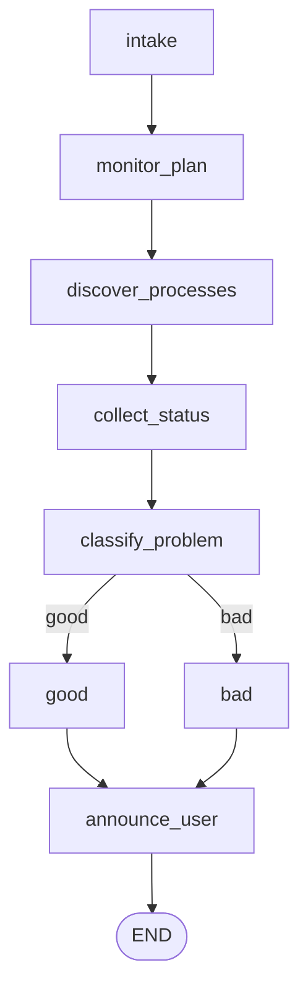

# Oracle GoldenGate Monitor Graph Architecture

## Overview

This document describes the LangGraph architecture for an Oracle GoldenGate monitoring agent. The graph is designed as a bounded monitoring and investigation workflow:

1. Accept monitoring scope and policies.
2. Discover and inspect GoldenGate processes.
3. Detect and classify anomalies.
4. Enrich the investigation with diagnostics.
5. Assess impact and decide whether to record, notify, escalate, or continue investigating.
6. Support either one-shot execution or continuous polling.

The monitor_plan node is responsible for generating three rule families that drive the rest of the graph:

1. Process state rules.
2. Lag time rules.
3. Disk usage rules.

## Mermaid Diagram

## Review Notes

1. The previous draft mixed presentation labels such as `Classify Problem` and `Announce to user` with Python-style node names. The implementation uses normalized snake_case names for graph nodes.
2. The previous draft mentioned disk usage rules in `monitor_plan` but did not show them clearly in downstream processing. The implementation carries disk metrics through `collect_status` and evaluates them in `classify_problem`.
3. The previous draft implied `Good` and `Bad` were terminal states. In the implemented graph they are formatting nodes that prepare operator-facing output before `announce_user` emits the final report.

## Node Purposes

### intake
Captures the operator request or scheduler input. This node defines the monitoring target, process filters, runtime mode, thresholds, and alerting policy.

### monitor_plan
Transforms raw input into an executable monitoring plan. It loads the OGG environment configuration and the rule sets that determine whether downstream classification should mark processes as good or bad. Its main output is a normalized rules object with three parts: process state rules for running, stopped, abended, and missing processes; lag time rules for warning and critical lag thresholds; and disk usage rules for GoldenGate home, trail, and log filesystem thresholds.

### discover_processes
Builds the GoldenGate inventory for the current run. This is where the workflow determines which Extract, Replicat, Distribution, Receiver, and Manager processes are expected and visible.

### collect_status
Collects raw telemetry for each discovered process. Typical outputs include running state, lag, checkpoint status, last restart time, log scanning for `ERROR` entries, and filesystem usage metrics for the GoldenGate environment.

### classify_problem
Based on the rules loaded from `monitor_plan`, it compares expected values with the collected values from `collect_status` and decides whether the monitoring run is good or bad. It evaluates process state, lag time, log errors, and disk usage.

### Good
Formats the success path. It prepares a concise healthy summary for the final reporting node.

### Bad
Formats the failure path. It reports when processes crashed or restarted, what errors were found in the logs, and what the operator should do next.

### Announce to user
Summarizes the final result and produces the operator-facing report.

## Edge Purposes

### intake -> monitor_plan
Moves from raw input to a structured monitoring strategy.

The resulting plan should include process_state_rules, lag_time_rules, and disk_usage_rules for downstream evaluation.

### monitor_plan -> discover_processes
Uses the plan to determine which GoldenGate processes must be inspected.

It also passes forward the rule sets that later nodes use to judge health.

### discover_processes -> collect_status
Turns process inventory into live telemetry collection.

### collect_status -> classify_problem
Passes the raw status snapshot, lag measurements, log errors, and disk usage metrics into `classify_problem`.

### classify_problem -> good
If the collected data passes the configured rules, route to the `good` node.

### classify_problem -> bad
If the collected data fails any configured rule, route to the `bad` node.

### good/bad -> announce_user
Both formatting paths converge in `announce_user`, which emits the final report and ends the run.

###
1. Read the Mermaid diagram to understand the control flow.
2. Read the node summaries to understand responsibilities.
3. Read the edge summaries to understand routing logic and loop boundaries.
4. Use this document together with [context/Lesson_6_Student.py](context/Lesson_6_Student.py) when implementing the LangGraph version.

## Implementation Notes

- Keep collection nodes separate from decision nodes so the graph stays testable and easy to extend.
- Keep the first version read-only. Avoid automatic restart or remediation until monitoring quality is proven.
- Replace in-memory checkpointing with durable checkpointing before using this in a production operations workflow.
- Add source and timestamp metadata to evidence records so repeated polling does not create ambiguous state.