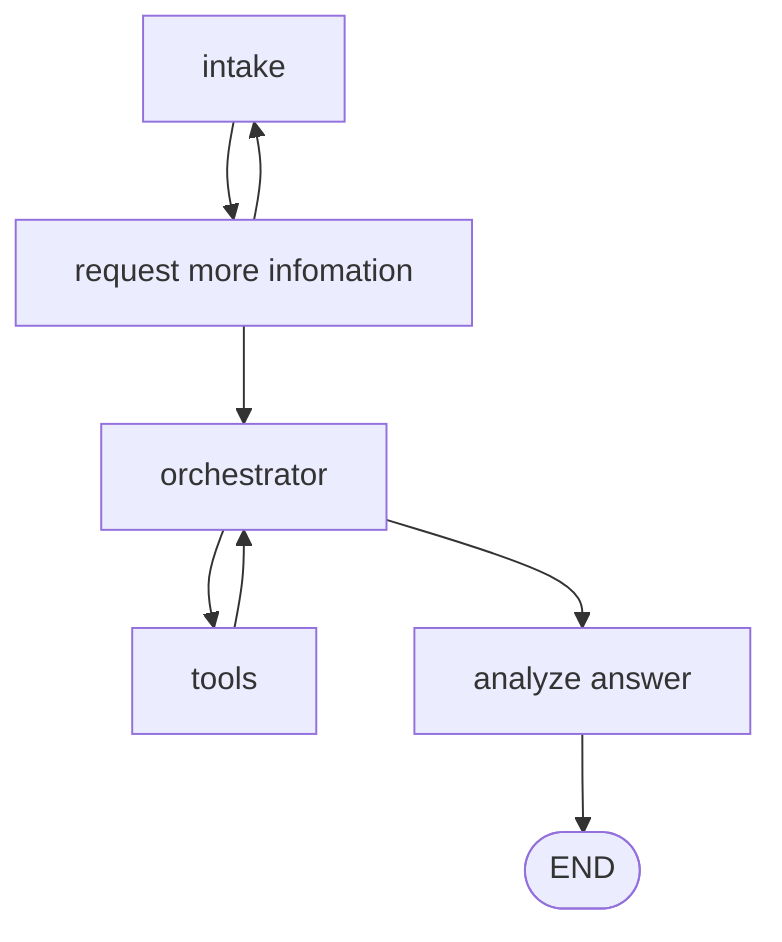

# Oracle GoldenGate Monitor Graph Architecture

## Overview

This document describes the LangGraph architecture for the current Oracle GoldenGate monitoring agent implementation in [goldengate_monitor_graph.py](../goldengate_monitor_graph.py). The graph is a short, linear workflow that uses an LLM with bound Paramiko tools to inspect a GoldenGate host and summarize the result.

1. Accept monitoring scope and policies.
2. Build a monitoring plan from the default config and user input.
3. Discover GoldenGate processes and gather operating data.
4. Classify problems from the discovered data.
5. Produce a final operator-facing report.

The graph currently binds four SSH tools to the model using `langchain_core.tools.tool` and `ChatOpenAI.bind_tools`:

1. `connect_ssh` connects to the target host with `ssh.connect`.
2. `get_process` runs `info all`.
3. `check_log` runs `view report <process_name>`.
4. `check_disk` runs `df -h`.

## Mermaid Diagram

## Review Notes

1. The previous architecture draft described a richer branch structure with `collect_status`, `good`, and `bad` nodes. The current Python file does not include those nodes.
2. The current implementation routes the flow directly from `discover_processes` to `classify_problem`, then to `announce_user`.
3. The Python file binds SSH tools to the model, but the graph still uses the model directly inside nodes rather than a separate tool-execution node.

## Node Purposes

### intake
Captures the operator request or scheduler input. In the current code it sends the task text to the model with `PLAN_PROMPT` and stores the returned configuration in `config`.

### monitor_plan
Transforms the config into a monitoring plan. It copies the host settings, GoldenGate environment data, process filters, expected processes, state rules, lag rules, disk rules, and recommendations into a single `monitor_plan` object.

### discover_processes
Builds the GoldenGate inventory prompt and asks the model to use the bound SSH tools against the target host. The prompt describes the available operations: connect, get processes, check log, and check disk.

### classify_problem
Asks the model to classify the discovered data against the monitoring rules. The node builds a classification prompt from the discovered process data and the active rules, then stores the result in `problems`.

### announce_user
Summarizes the final result and produces the operator-facing report. It takes the detected problems and converts them into a user-facing announcement.

## Edge Purposes

### intake -> monitor_plan
Moves from raw input to a structured monitoring strategy.

The resulting plan includes host settings, process filters, process_state_rules, lag_time_rules, disk_usage_rules, and recommendations for downstream prompts.

### monitor_plan -> discover_processes
Uses the plan to determine which GoldenGate host and GoldenGate-specific settings should be included in the discovery prompt.

### discover_processes -> classify_problem
Passes the model-generated discovery output directly into classification.

### classify_problem -> announce_user
Converts the classification result into a final operator-facing summary.

### announce_user -> END
Ends the workflow after producing the report.

## Reading Order
1. Read the Mermaid diagram to understand the control flow.
2. Read the node summaries to understand responsibilities.
3. Read the edge summaries to understand routing logic and loop boundaries.
4. Use this document together with [context/Lesson_6_Student.py](context/Lesson_6_Student.py) when implementing the LangGraph version.

## Implementation Notes

- The graph currently relies on LLM prompting rather than explicit Python parsing for discovery and classification.
- The Paramiko tools are bound to the model and can be invoked for SSH connectivity, GoldenGate process listing, report inspection, and disk checks.
- The workflow remains read-only and does not perform restart or remediation actions.